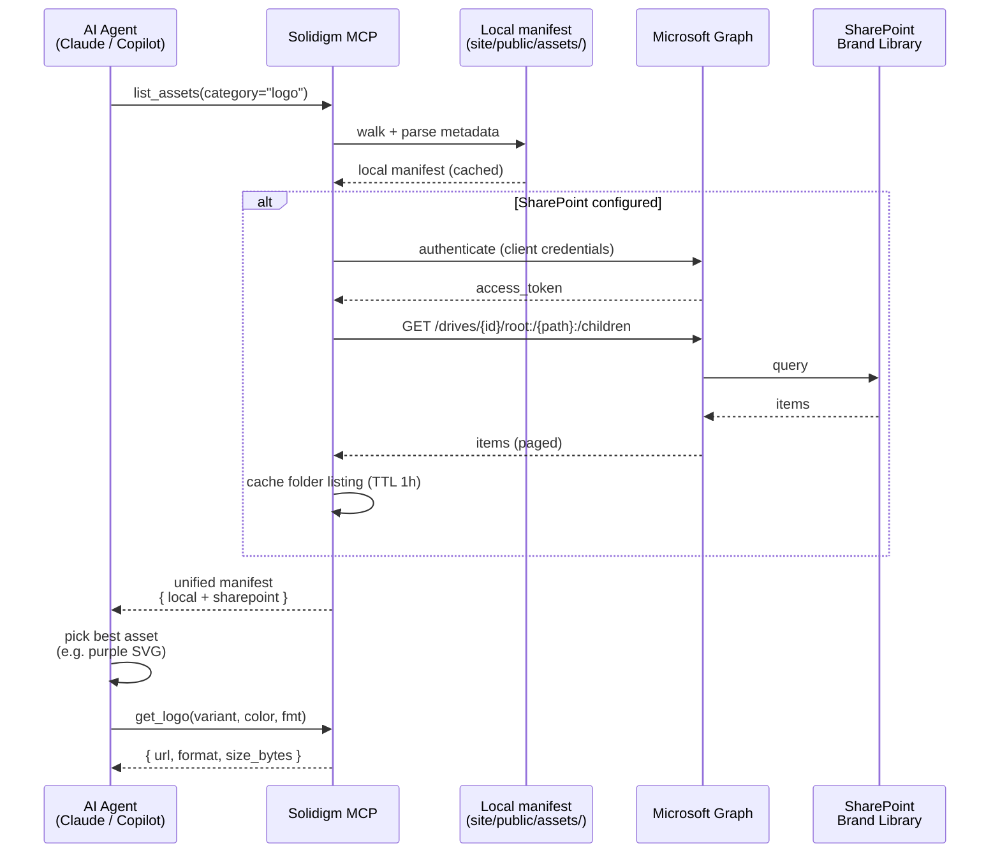
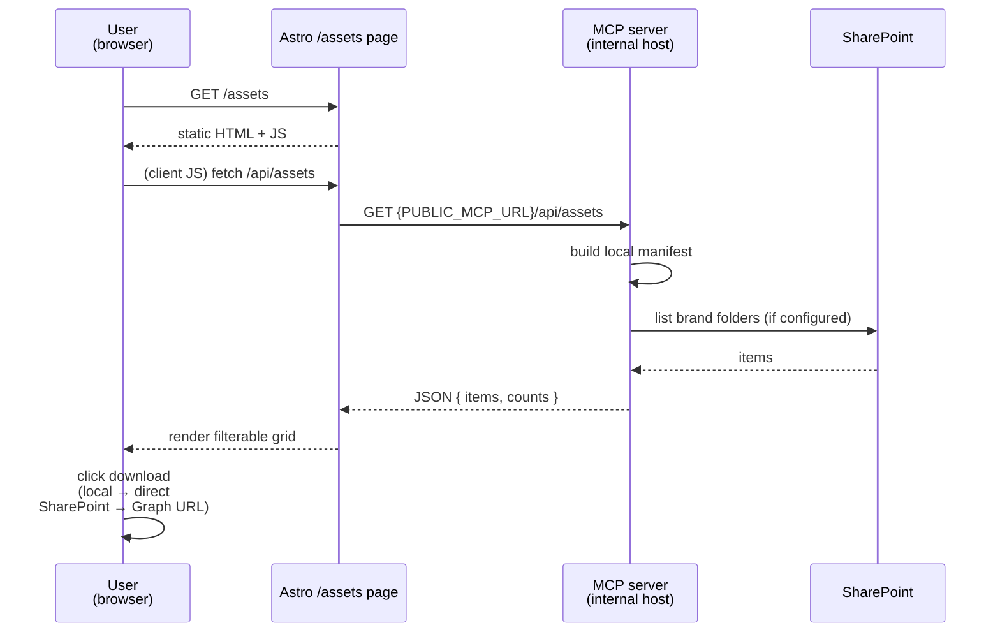
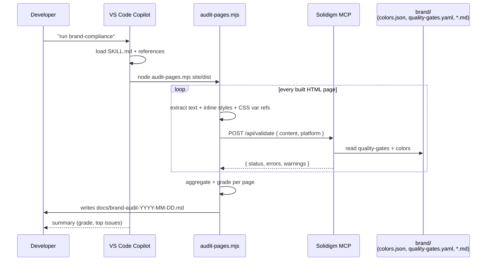

# Solidigm Brand System — Architecture

This document describes how the Solidigm design system is structured and how
AI agents, developers, and designers all consume the same canonical source.

## Principles

1. **One source of truth.** Tokens, guidelines, UI toolkit, and official
   brand assets all live in this repository or in the SharePoint brand
   library — never duplicated.
2. **Multiple surfaces, one backend.** The MCP server is the unified access
   layer. AI agents, the Astro site, and internal tools all read from it.
3. **Read-only by default.** Assets and guidelines are published artifacts;
   writes go through the normal design/engineering PR flow.
4. **Static-first where possible.** The documentation site is static (GitHub
   Enterprise Pages on Solidigm VPN). Only the asset-browser page calls the
   MCP server at runtime.
5. **Secrets stay out of the repo.** `.env` files, the MCP handoff doc, and
   raw asset dumps are gitignored.

## System diagram

```mermaid
flowchart TB
    %% -------------------- Sources --------------------
    subgraph Sources["📦 Source of truth (this repo + SharePoint)"]
        direction TB
        tokensSrc["tokens/*.json (10)<br/>W3C DTCG<br/>colors · typography · space<br/>breakpoints · radius · shape<br/>motion · elevation · semantic · icons"]
        brandSrc["brand/<br/>*.md · colors.json<br/>quality-gates.yaml<br/>platforms/"]
        guidelinesSrc["brand/*.md<br/>topic guidelines"]
        toolkitSrc["site/public/<br/>ui-toolkit.min.css"]
        localAssets["site/public/assets/<br/>logos · illustrations · docs"]
        sharepointSrc[("SharePoint<br/>Brand Library")]
    end

    %% -------------------- Build --------------------
    subgraph Build["🛠️ Build pipeline"]
        direction LR
        buildJs["build.js<br/>token compiler"]
        distNpm[["@solidigm/brand-tokens<br/>NPM package"]]
        syncToolkit["sync-toolkit.mjs<br/>prebuild"]
        astroBuild["astro build"]
        distSite[["site/dist/<br/>static HTML"]]
    end

    tokensSrc --> buildJs --> distNpm
    toolkitSrc --> syncToolkit
    tokensSrc --> astroBuild
    syncToolkit --> astroBuild
    astroBuild --> distSite

    %% -------------------- MCP Server --------------------
    subgraph MCP["🧠 Solidigm Brand MCP (Python · FastMCP)"]
        direction TB
        mcpTools["Tools (15)<br/>get_design_tokens · get_color<br/>get_spacing · get_breakpoints<br/>get_motion · get_icon<br/>get_brand_guidelines · get_ui_toolkit_class<br/>list_assets · get_asset · get_logo<br/>search_brand_source_documents<br/><b>get_brand_context</b> · <b>get_brand_system_prompt</b><br/><b>validate_brand_output</b>"]
        mcpResources["Resources (8)<br/>brand://tokens/{colors,typography,space,motion,icons}<br/>brand://guidelines/main<br/>brand://toolkit/css<br/>brand://assets/manifest"]
        mcpComposer["Composer<br/>colors · context · prompts<br/>validation · assets · cache"]
        mcpHttp["HTTP routes (7)<br/>/api/assets · /api/validate · /api/health<br/>/api/stats · /api/thumb<br/>/microsoft/authorize · /microsoft/callback"]
        graphClient["Graph API client<br/>OAuth2 PKCE + client credentials<br/>TTL cache · 429 retry"]
    end

    tokensSrc -.read.-> mcpTools
    brandSrc -.read.-> mcpComposer
    mcpComposer --> mcpTools
    guidelinesSrc -.read.-> mcpComposer
    toolkitSrc -.read.-> mcpTools
    localAssets -.walk.-> mcpResources
    graphClient -->|Microsoft Graph| sharepointSrc
    mcpTools --> graphClient

    %% -------------------- Skill Layer --------------------
    subgraph Skills["✨ VS Code Copilot Skill Layer"]
        direction TB
        wsInstr[".github/<br/>copilot-instructions.md<br/><i>always-on</i>"]
        fileInstr[".github/instructions/<br/>solidigm-brand.instructions.md<br/><i>applyTo: *.astro,css,md,…</i>"]
        prompt[".github/prompts/<br/>brand-check.prompt.md<br/><i>/brand-check</i>"]
        skill[".github/skills/<br/>brand-compliance/SKILL.md<br/><i>site audit workflow</i>"]
    end

    Skills -->|invoke tools| mcpTools
    skill -->|POST| mcpHttp

    %% -------------------- Consumers --------------------
    subgraph Consumers["👥 Consumers"]
        direction TB
        ai["🤖 AI agents<br/>Claude · Cursor · Copilot · ChatGPT"]
        devs["👩‍💻 Developers<br/>VS Code · npm install"]
        designers["🎨 Designers<br/>Figma · Token Studio"]
        site["🌐 Astro /assets page<br/>browser"]
    end

    ai -->|MCP protocol| mcpTools
    ai -->|read_resource| mcpResources
    devs -->|.vscode/mcp.json| mcpTools
    devs -->|import tokens| distNpm
    designers -->|figma/tokens.json| tokensSrc
    site -->|fetch /api/assets| mcpHttp
    site -->|browse static pages| distSite

    %% -------------------- Deployment --------------------
    subgraph Deploy["🚀 Deployment"]
        direction LR
        ghPages[["GitHub Enterprise Pages<br/>Solidigm VPN"]]
        internalHost[["Internal host<br/>VM / Container<br/>Solidigm VPN"]]
    end

    distSite --> ghPages
    MCP --> internalHost
    site -.calls at runtime.-> internalHost

    %% -------------------- Styling --------------------
    classDef src fill:#f5f3f1,stroke:#8d59cf,color:#160231
    classDef build fill:#ffffff,stroke:#4f00b5,color:#160231
    classDef mcp fill:#f0e6fb,stroke:#4f00b5,color:#160231,stroke-width:2px
    classDef skillNode fill:#fffbe6,stroke:#ffd000,color:#160231
    classDef consumer fill:#ffffff,stroke:#21201f,color:#160231
    classDef deploy fill:#e9e8e7,stroke:#52514f,color:#160231

    class tokensSrc,brandSrc,guidelinesSrc,toolkitSrc,localAssets,sharepointSrc src
    class buildJs,distNpm,syncToolkit,astroBuild,distSite build
    class mcpTools,mcpResources,mcpComposer,mcpHttp,graphClient mcp
    class wsInstr,fileInstr,prompt,skill skillNode
    class ai,devs,designers,site consumer
    class ghPages,internalHost deploy
```

## Flow: AI agent requests a brand asset

## Flow: Designer/Engineer via the Astro site

## Flow: brand-compliance Skill audits the site

## Deployment model

| Component | Host | Access |
|-----------|------|--------|
| NPM token package | GitHub Packages | Solidigm GitHub org members with PAT |
| Astro site (static) | GitHub Enterprise Pages | Solidigm VPN |
| MCP server | Internal VM or Azure App Service | Solidigm VPN |
| SharePoint brand library | Microsoft 365 (Solidigm tenant) | Entra SSO |

The MCP server's public URL is injected into the Astro build via the
`PUBLIC_MCP_URL` environment variable (see `site/.env.example`).

## Files of interest

- `brand/` — canonical brand content (topic markdown, `colors.json`, `quality-gates.yaml`, platform overrides)
- `brand_mcp/server.py` — FastMCP app wiring tools, resources, and HTTP routes
- `brand_mcp/composer/` — colors, context, prompts, validation, assets, cache
- `brand_mcp/utils/m365_oauth.py` — Graph API client, OAuth flows
- `brand_mcp/tools/brand.py` — tool implementations (tokens, guidelines, assets)
- `.github/copilot-instructions.md` — always-on Copilot rules
- `.github/instructions/solidigm-brand.instructions.md` — scoped file-instruction rules
- `.github/prompts/brand-check.prompt.md` — `/brand-check` prompt
- `.github/skills/brand-compliance/` — site audit Skill + `audit-pages.mjs`
- `.vscode/mcp.json` — VS Code Copilot MCP registration
- `site/src/pages/assets.astro` — browser asset-library UI
- `tokens/*.json` — canonical design tokens (W3C DTCG)
- `brand/*.md` — canonical brand guidelines (voice, color, typography, logo, do-nots, etc.)

## Roadmap

See [`docs/roadmap.md`](roadmap.md) for implementation status and next steps.
